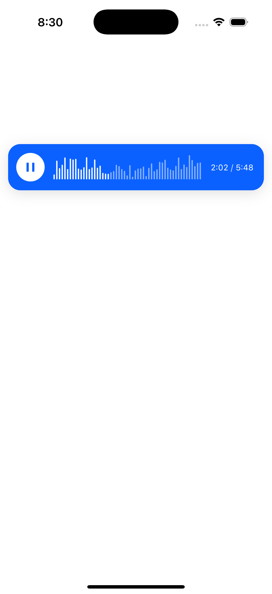
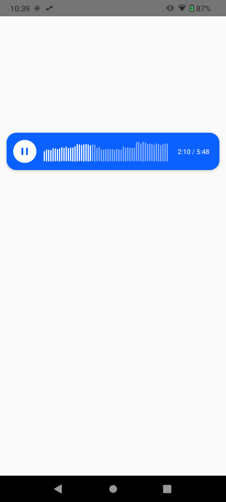

# React Native Audiowave

A high-performance React Native audio waveform component with built-in playback controls, seek functionality, and real-time visualization. Built with Turbo Native Modules for optimal performance.

## Features

- 🎵 **Real-time Audio Visualization** - Dynamic waveform rendering with customizable appearance
- 🎮 **Built-in Playback Controls** - Play, pause, stop, and seek functionality
- 📱 **Cross-platform Support** - Works seamlessly on both iOS and Android
- ⚡ **Turbo Native Module** - High-performance native implementation
- 🎨 **Customizable UI** - Flexible styling and theming options
- 📊 **Audio Asset Resolution** - Support for both local and remote audio files

## Screenshots

> **Note:** Add your sample UI screenshots here to showcase the component in action.

### iOS Screenshot


### Android Screenshot  


## Installation

### Prerequisites

- React Native 0.71+
- iOS 12.0+ / Android API 21+
- For iOS: Xcode 14.0+

### Install the package

```bash
yarn add @moeez12/react-native-audiowave
# or
npm install @moeez12/react-native-audiowave
```

### iOS Setup

The following iOS frameworks need to be manually linked in Xcode:

- **CoreMedia.framework** - Core media functionality
- **Accelerate.framework** - High-performance vector and matrix operations
- **AudioToolbox.framework** - Audio processing and playback
- **AVFoundation.framework** - Audio/visual media handling

#### Manual Linking Steps:

1. **Open your iOS project in Xcode**
   ```bash
   cd ios && open YourProject.xcworkspace
   ```

2. **Select your project target** in the left sidebar

3. **Go to "General" tab** → "Frameworks, Libraries, and Embedded Content"

4. **Click the "+" button** and add each framework:
   - CoreMedia.framework
   - Accelerate.framework
   - AudioToolbox.framework
   - AVFoundation.framework

5. **Ensure "Embed & Sign"** is selected for each framework

6. **Clean and rebuild** your project

### Android Setup

No additional configuration required for Android.

## Usage

### Basic Implementation

```tsx
import React, { useState } from 'react';
import { View, StyleSheet } from 'react-native';
import AudioWaveform from '@moeez12/react-native-audiowave';

const App = () => {
  const [audioUrl, setAudioUrl] = useState('path/to/your/audio.mp3');

  return (
    <View style={styles.container}>
      <AudioWaveform
        audioUrl={audioUrl}
        style={styles.waveform}
        onPlaybackStateChange={(state) => console.log('Playback:', state)}
        onSeek={(position) => console.log('Seek to:', position)}
      />
    </View>
  );
};

const styles = StyleSheet.create({
  container: {
    flex: 1,
    justifyContent: 'center',
    alignItems: 'center',
    backgroundColor: '#f5f5f5',
  },
  waveform: {
    width: '100%',
    height: 200,
  },
});
```

### Advanced Configuration

```tsx
<AudioWaveform
  audioUrl="https://example.com/audio.mp3"
  style={styles.waveform}
  waveformColor="#007AFF"
  backgroundColor="#FFFFFF"
  progressColor="#34C759"
  cursorColor="#FF3B30"
  showPlayButton={true}
  showSeekBar={true}
  autoPlay={false}
  onPlaybackStateChange={(state) => {
    switch (state) {
      case 'playing':
        console.log('Audio is playing');
        break;
      case 'paused':
        console.log('Audio is paused');
        break;
      case 'stopped':
        console.log('Audio is stopped');
        break;
    }
  }}
  onSeek={(position) => {
    console.log(`Seeked to ${position} seconds`);
  }}
  onError={(error) => {
    console.error('Audio error:', error);
  }}
/>
```

## API Reference

### Props

| Prop | Type | Default | Description |
|------|------|---------|-------------|
| `audioUrl` | `string` | **Required** | URL or path to the audio file |
| `style` | `ViewStyle` | `{}` | Custom styling for the waveform container |
| `waveformColor` | `string` | `#007AFF` | Color of the waveform bars |
| `backgroundColor` | `string` | `#FFFFFF` | Background color of the waveform |
| `progressColor` | `string` | `#34C759` | Color of the playback progress |
| `cursorColor` | `string` | `#FF3B30` | Color of the seek cursor |
| `showPlayButton` | `boolean` | `true` | Whether to show the play/pause button |
| `showSeekBar` | `boolean` | `true` | Whether to show the seek bar |
| `autoPlay` | `boolean` | `false` | Whether to start playing automatically |
| `onPlaybackStateChange` | `function` | - | Callback when playback state changes |
| `onSeek` | `function` | - | Callback when seeking occurs |
| `onError` | `function` | - | Callback when audio errors occur |

### Playback States

- `'playing'` - Audio is currently playing
- `'paused'` - Audio is paused
- `'stopped'` - Audio is stopped
- `'loading'` - Audio is loading
- `'error'` - An error occurred

## Performance

This library is built with **Turbo Native Modules**, providing:

- **Faster startup times** compared to legacy bridge architecture
- **Reduced memory usage** through efficient native communication
- **Better performance** for audio processing and visualization
- **Synchronous method calls** where possible
- **Optimized native code** generation

## Troubleshooting

### Common Issues

1. **Audio not playing on iOS**
   - Check that audio files are in supported formats (MP3, WAV, M4A)

2. **Waveform not rendering**
   - Verify audio file path/URL is correct
   - Check console for error messages
   - Ensure audio file is accessible

3. **Build errors on iOS**
   - Clean build folder: `cd ios && rm -rf build && cd ..`
   - Reinstall pods: `cd ios && pod install && cd ..`

<!-- ### Debug Mode

Enable debug logging by setting the environment variable:
```bash
export RN_AUDIOWAVE_DEBUG=true
``` -->

<!-- ## Contributing

We welcome contributions! Please see our [Contributing Guide](CONTRIBUTING.md) for details. -->

## License

This project is licensed under the MIT License - see the [LICENSE](LICENSE) file for details.

## Support

- 📧 Email: moeez.ahmad.dev127@gmail.com
- 🐛 Issues: [GitHub Issues](https://github.com/moeezahmad77/react-native-audiowave/issues)
- 📖 Documentation: [GitHub Wiki](https://github.com/moeezahmad77/react-native-audiowave/wiki)

---

Made with ❤️ by [Moeez Ahmad](https://github.com/moeezahmad77)
